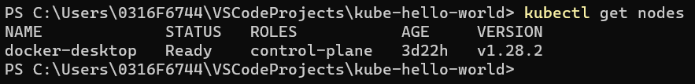

# Creation of Docker Image and Deploying the containers on Kubernetes PODs hosted on Docker Desktop

## Creation of Docker Image

### Validate if current nodes points to the local Docker Desktop Single Node Cluster or any other instance of any Cloud or so:
`kubectl get nodes`

### Move to the directory containing the `Dockerfile`

`<path-to-project>\kube-hello-world`

### Build the Docker Image of the application:

`docker build -t kube-hello-world:v1.0 .`

### Check if the Docker image is successfully created:
`docker images`

## Deploying the containers on Kubernetes PODs hosted on Docker Desktop

### Start the PODs of my current application

`kubectl apply -f k8s-deployment.yaml` 
[The deployment configuration file name (k8s-deployment.yaml) can be given anything in other project]

### Check if the PODs were successfully created

`kubectl get pods`

### Start to expose the PODs as a Service

`kubectl apply -f k8s-service.yaml`

### Describe and check the details of the service exposed

`kubectl describe services kube-hello-world-svc`

### Check the `LoadBalancer Ingress` IP/Host [As service is exposed as type: LoadBalancer] & TargetPort and try access the API

e.g. `http://localhost:8080/v1/hello/Arka`

## Some useful Commands:

### Kubernetes Commands -

### Command to find Internal IP by describing nodes Config JSON:
`kubectl get nodes --output json`

### Command to Gracefully Terminate a POD:
`kubectl delete pod my-pod`

### Command to Forcefully Terminate a POD:
`kubectl delete pod my-pod --force`

### Command to STOP all the PODs running in a specific namespace [Here `default` namespace]:
`kubectl delete all --all --namespace default`

### Docker Commands -

### Docker command to clean up any resources — images, containers, volumes, and networks — that are dangling (not tagged or associated with a container):
`docker system prune`

### To additionally remove any stopped containers and all unused images (not just dangling images), need to add the -a flag to the command:
`docker system prune -a`
